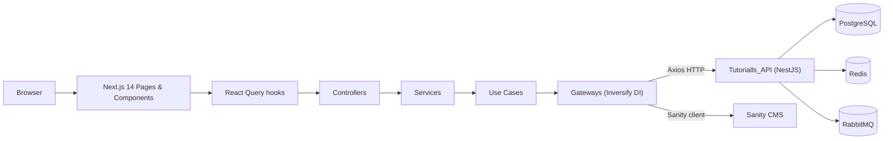

# Tutorialls Website


<h4 align="center">🚀 🟩 Full-stack Tutorial Platform 🟩 🚀</h4>

<h4 align="center">Next.js 14 frontend built on Clean + Hexagonal Architecture — consume, search, create, edit and delete tutorials.</h4>

#

<p align="center">
  |&nbsp;&nbsp;
  <a style="color: #8a4af3;" href="#about">About</a>&nbsp;&nbsp;&nbsp;|&nbsp;&nbsp;&nbsp;
  <a style="color: #8a4af3;" href="#techs">Technologies</a>&nbsp;&nbsp;&nbsp;|&nbsp;&nbsp;&nbsp;
  <a style="color: #8a4af3;" href="#architecture">Architecture</a>&nbsp;&nbsp;&nbsp;|&nbsp;&nbsp;&nbsp;
  <a style="color: #8a4af3;" href="#run-project">Run</a>&nbsp;&nbsp;&nbsp;|&nbsp;&nbsp;&nbsp;
  <a style="color: #8a4af3;" href="#commands">Commands</a>&nbsp;&nbsp;&nbsp;|&nbsp;&nbsp;&nbsp;
  <a style="color: #8a4af3;" href="#docs">Docs</a>&nbsp;&nbsp;&nbsp;|&nbsp;&nbsp;&nbsp;
  <a style="color: #8a4af3;" href="#author">Author</a>&nbsp;&nbsp;&nbsp;|&nbsp;&nbsp;&nbsp;
</p>

#

<p align="center">
  
  
  
  
  
  
  
</p>

<p align="center">
  
  
  
</p>

#

<br>

<h2 id="about"> 🛰️ | 💡 About: </h2>

<p align="justify">
A full-stack tutorial platform: <b>consume</b> tutorials, <b>search</b> with filters (title, author, keyword), and <b>create / edit / delete</b> tutorials behind JWT authentication. This repository is the <b>Next.js 14 frontend</b>; it consumes the companion <b>NestJS API</b> (PostgreSQL + Redis + RabbitMQ) and <b>Sanity CMS</b> for static page content.

The project is a learning showcase of <b>Clean Architecture</b> and <b>Hexagonal Architecture</b> applied inside a Next.js app — with an InversifyJS dependency-injection container, layered modules and interface-driven domain code.
</p>

<br>

🔭 | API Repository: [[Tutorialls_API](https://github.com/Samuel-Ricardo/Tutorialls_API)] <br>
📡 | Frontend on Vercel: [https://tutorialls-website.vercel.app/](https://tutorialls-website.vercel.app/) <br>
🟢 | API on Render: [https://tutorialls-api-sha256.onrender.com/](https://tutorialls-api-sha256.onrender.com/) <br>
📑 | API Swagger (OpenAPI): [https://tutorialls-api-sha256.onrender.com/api/docs](https://tutorialls-api-sha256.onrender.com/api/docs)

<br>

#


<h2 id="techs"> :building_construction: | Technologies and Concepts Studied: </h2>

### 💡 | Feature Highlights

- **Welcome page** driven by Sanity CMS static content (text + images via CDN) with graceful fallbacks — `LazyParagraph` / `LazyImage`
- **JWT authentication** with protected routes (`AuthWall`) — login, signup modal, session restore
- **Real-time validated forms** — react-hook-form + Zod resolvers on every form
- **Search with filters** — by title, author and keyword-in-content against the API (pagination-ready)
- **Full tutorial CRUD** — create, update, delete with modal forms + toast feedback
- **Responsive-capable UI** — TailwindCSS fluid layouts, lime design system
- **Performance focus** — `next/image` optimization, React Query, lazy hydration patterns

### ⚙️ | Tech Stack

| Group | Technologies (versions from `tutorialls/package.json`) |
|---|---|
| **Framework** | Next.js `14.2.7` · React `^18` · TypeScript `^5` · TailwindCSS `^3.4.1` |
| **UI** | react-hot-toast `^2.4.1` · react-icons `^5.3.0` · styled-components `^6.1.12` *(declared, unused)* |
| **State / Data** | @tanstack/react-query `^5.52.2` · zustand `^4.5.5` · axios `^1.7.5` · swr `^2.2.5` *(declared, unused)* |
| **Validation** | Zod `^3.23.8` · react-hook-form `^7.53.0` · @hookform/resolvers `^3.9.0` |
| **DI / Architecture** | InversifyJS `^6.0.2` · inversify-inject-decorators `^3.1.0` · reflect-metadata `^0.2.2` · dotenv `^16.4.5` |
| **CMS** | Sanity `^3.56.0` · next-sanity `^9.4.7` · @sanity/vision `^3.56.0` · @sanity/image-url `^1.0.2` |
| **Auth** | jsonwebtoken `^9.0.2` *(client-side decode)* |
| **Testing** | Jest `^29.7.0` · ts-jest · jest-environment-jsdom · jest-mock-extended `^3.0.7` · Cypress `^13.14.0` |
| **Quality** | ESLint `^8` · eslint-config-next `14.2.7` · Prettier `^3.3.3` · Husky `^9.1.5` · lint-staged `^15.2.9` |
| **Infra** | Docker (node `20.10.0-slim`) · docker-compose (6 services) · GitHub Actions (GHCR) · Vercel |

> ⚠️ **Accuracy note:** the original README listed *MongoDB* — the platform actually runs **PostgreSQL** (used by the companion API; `docker-compose.yaml` exposes `postgres` on `:5432`). No MongoDB service or client exists anywhere in this repo.

<br>

#


<h2 id="architecture"> 🏗️ | Architecture at a Glance: </h2>



- A full **NestJS-inspired modular monolith** runs in the browser: `InversifyJS Container` + `Symbol.for()` registries, per-layer `module / registry / factory` triads, and lazy property injection.
- Four layers in `src/@module/`: **Domain** (pure interfaces/entities/DTOs), **Application** (controllers, services, use cases, gateways), **Infrastructure** (config, engines), **Presentation** (pages/components/hooks/stores).
- Data flows: **component → react-query hook → controller → service → use case → gateway → (axios → NestJS API | sanity client → Sanity CMS)**.
- Route protection is client-side today via `AuthWall` (no `middleware.ts`) — see `docs/01-architecture.md` for the honest assessment.

> 📖 **Deep dive:** [docs/01-architecture.md](docs/01-architecture.md) — layer map, DI internals, auth flow (mermaid sequence), purity violations with `file:line` evidence.

<br>

#

<br>

<h2 id="app"> 💻 | Application: </h2>

| Screen | Preview |
|---|---|
| **Welcome** — CMS-driven hero, redirects to login |  |
| **Login / Signup** — real-time validation, modal signup, auto-redirect |  |
| **Tutorials** — search, filters, CRUD modals, auth wall |  |
| **Responsive / Performance** |  |

> ⚠️ The *performance/caching* claim from the original README ("cacheia as pesquisas já feitas") is **not implemented** — all tutorial reads run through `useMutation` without query-key caching. See [docs/07-findings.md](docs/07-findings.md) (F-09).

<br>

#

<h2 id="run-project"> 👨‍💻 | How to use </h2>

### Option A — Docker Compose (full local stack)

> ⚠️ **Corrected ports:** the old README claimed PostgreSQL on `:27017`. The actual stack maps **PostgreSQL on `:5432`** (`docker-compose.yaml:62-63`; `27017` is MongoDB's default port — a stale copy-paste).

```bash
# 1. Clone
$ git clone "git@github.com:Samuel-Ricardo/tutorialls_website.git"

# 2. Navigate to the app
$ cd ./tutorialls/

# 3. Create env files (based on the examples)
$ cp .env.example .env          # API-side vars (used by the api service)
$ cp .env.local.example .env.local  # Frontend vars (used by site + build)

# 4. Build & run
$ docker-compose up --build     # first time
$ docker-compose up             # afterwards
```

| Service | URL / Port | Notes |
|---|---|---|
| `site` (Next.js frontend) | http://localhost:3000 | Builds from `./tutorialls/Dockerfile` |
| `api` (NestJS backend) | http://localhost:3001 | `ghcr.io/samuel-ricardo/tutorialls_api:main` |
| `postgres` | `localhost:5432` | `root:root@postgres:5432/tutorialls_database` |
| `pgadmin` | http://localhost:5050 | DB dashboard — `admin@example.com` / `admin` |
| `rabbitmq` | `:5672` · dashboard :15672 | `admin` / `admin` |
| `redis` | `localhost:6379` | Cache |

### Option B — Docker image (GHCR)

```bash
$ docker pull ghcr.io/samuel-ricardo/tutorialls_website:main
```

> See [docs/04-infrastructure.md](docs/04-infrastructure.md) for known image caveats (runtime rebuild, env plumbing).

### Option C — Local dev (no Docker)

```bash
$ cd ./tutorialls/
$ npm install
$ npm run start:dev   # needs the API + Postgres + Redis + RabbitMQ running
```

<br>

#


<h2 id="structure"> 🗂️ | Project Structure </h2>

```text
tutorialls_website/
├── .github/workflows/docker-publish.yml   # GHCR build + cosign signing
├── .husky/pre-commit                      # → npx lint-staged (app)
├── LICENSE                                # MIT
├── README.md                              # ← you are here
└── tutorialls/                            # ⭐ the Next.js 14 app
    ├── Dockerfile · docker-compose.yaml   # 6-service stack
    ├── jest.config.mjs · jest-e2e.config.mjs
    ├── cypress/E2E/                       # 2 e2e journeys (auth, tutorials)
    ├── sanity.config.ts · sanity.cli.ts   # Sanity Studio wiring
    ├── .env.example · .env.local.example
    └── src/
        ├── @module/                       # Clean/Hexagonal layers + Inversify DI
        │   ├── domain/                    #   interfaces, entities, DTOs (pure TS)
        │   ├── application/               #   controllers, services, use cases, gateways
        │   ├── infra/                     #   config, engines (jwt, http, sanity)
        │   └── app.{module,registry,facotry}.ts  # root DI composition
        ├── app/                           # App Router: / , /login, /tutorials, /studio/*
        ├── component/                     # buttons, cards, forms, lists, modals, lazy
        ├── hook/                          # 12 react-query hooks (auth, cms, tutorial)
        ├── store/                         # 5 zustand stores (session, search, modals)
        ├── validation/zod/                # form + search schemas
        ├── sanity/                        # schemas, clients, structure
        └── global/ · internal/ · pagination/ · provider/ · @type/
```

> ⚠️ `tutorialls/.docker/data/db/` — a live **PostgreSQL data directory (1,285 files) is committed to git**. Treat it as a bug; see [docs/04-infrastructure.md](docs/04-infrastructure.md) and F-01 in [docs/07-findings.md](docs/07-findings.md).

<br>

#


<h2 id="commands"> 🧰 | Useful Commands </h2>

| Command | Purpose |
|---|---|
| `npm run start:dev` | Next.js dev server |
| `npm run build` | Production build (`next build`) |
| `npm run build:clean` | `format:fix` + `lint` + `test:coverage` → `build` *(used by Dockerfile)* |
| `npm run lint` / `npm run format:verify` | Lint / format check |
| `npm run test` | Jest unit suite (`--passWithNoTests`) |
| `npm run test:coverage` | Jest coverage report (`--passWithNoTests`) |
| `npm run test:integration` | Jest e2e config (`jest-e2e.config.mjs` — needs live API) |
| `npm run test:E2E:` | Cypress run *(note the trailing-colon script typo)* |
| `npm run test:cypress` | Cypress interactive runner |
| `npm run code:ci` | Format → lint → coverage (CI chain) |
| `npm run db:sync` | ⚠️ Vestigial: calls `prisma` — **not installed** in this frontend (belongs to the API repo) |

<br>

#


<h2 id="testing"> 🧪 | Testing Summary </h2>

| Suite | Files | Tests | Honest assessment |
|---|---|---|---|
| Jest unit | `use_case.spec.ts` | 14 | ✅ Real value — 7 tutorial use cases × (happy + failure path) |
| Jest „integration" | `sanity.gateway.spec.ts` | 1 | ❌ **Vacuous** — guard `go` is `undefined`, always skips |
| Jest „E2E" | `tutorial.e2e-spec.ts` | 6 | ⚠️ Non-hermetic — hits a live API, fixed `admin@admin.com`, 100 s timeout |
| Cypress | 2 specs | 2 journeys | ⚠️ Auth + create/search; never runs in CI; hardcoded `localhost:3000` |

Coverage (stale `coverage/lcov.info`, generated 2024-09-02): **65.98% line coverage over 51 files** — effective whole-`src` coverage ≈ **19%** (UI layer at 0%). See [docs/05-testing-qa.md](docs/05-testing-qa.md).

<br>

#


<h2 id="docs"> 📚 | Documentation Hub </h2>

| Doc | Description |
|---|---|
| [docs/README.md](docs/README.md) | Hub — reading order, severity legend, index |
| [docs/01-architecture.md](docs/01-architecture.md) | Layers, Inversify DI internals, data & auth flows, purity violations |
| [docs/02-frontend.md](docs/02-frontend.md) | Routes, components, state, forms, UX/a11y findings |
| [docs/03-cms-sanity.md](docs/03-cms-sanity.md) | Sanity schemas, GROQ, CDN bug, Studio |
| [docs/04-infrastructure.md](docs/04-infrastructure.md) | Docker, compose, CI/CD, Vercel, env vars |
| [docs/05-testing-qa.md](docs/05-testing-qa.md) | Test inventory, coverage math, quality gates |
| [docs/06-api-integration.md](docs/06-api-integration.md) | Companion NestJS API + frontend contract |
| [docs/07-findings.md](docs/07-findings.md) | Consolidated findings register (35 items) |
| [docs/08-roadmap.md](docs/08-roadmap.md) | Prioritized improvement roadmap |

<br>

#


<h2 id="assessment"> 📊 | Engineering Assessment </h2>

| Area | Verdict | Priority actions |
|---|---|---|
| **Architecture** | 🟢 Strong layering (Domain/Application/Infra/Presentation) — 3 purity violations | Fix `GlobalSession` import in gateway; dead-code sweep; DI factory typing fixes |
| **Testing** | 🔴 Not comprehensive — fake-green test, 0% UI coverage, tests can't run (broken `node_modules/jest-cli`) | `npm ci`; real coverage thresholds; fix/delete vacuous test; CI test job |
| **Infrastructure** | 🟠 Dangerous gaps — Postgres data committed (1,285 files), no `.dockerignore`, runtime rebuild | Remove DB dir from git; multi-stage Dockerfile; fix workflow env → build-args |
| **Security** | 🔴 `NEXT_PUBLIC_JWT_SECRET` shipped to browser; `jwt.decode` without verification; stale auth header | Move secrets server-side; `verify()` tokens; per-request auth header |
| **CMS & UX** | 🟠 Works end-to-end but CDN flag broken; a11y absent; „responsive" unverified | Fix CDN `\|\| true`; label/aria pass; honest docs vs claims |

<br>

#


<h2 id="author"> :octocat: | Author: </h2>

> <a target="_blank" href="https://www.linkedin.com/in/samuel-ricardo/">  <br> <p> <b> - Samuel Ricardo</b> </p></a>

<h1>
  <a href='https://github.com/Samuel-Ricardo'>
    
  </a>
  <a href='https://www.instagram.com/samuel_ricardo.ex/'>
    
  </a>
  <a href='https://twitter.com/SamuelR84144340'>
    
  </a>
  <a href='https://www.linkedin.com/in/samuel-ricardo/'>
    
  </a>
</h1>

<br>

<p align="center"> Built with 🟩 by Samuel Ricardo · MIT License · 2024 </p>