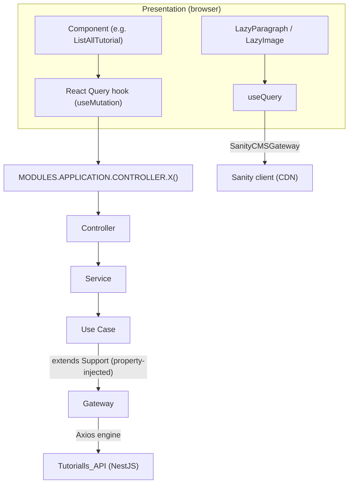
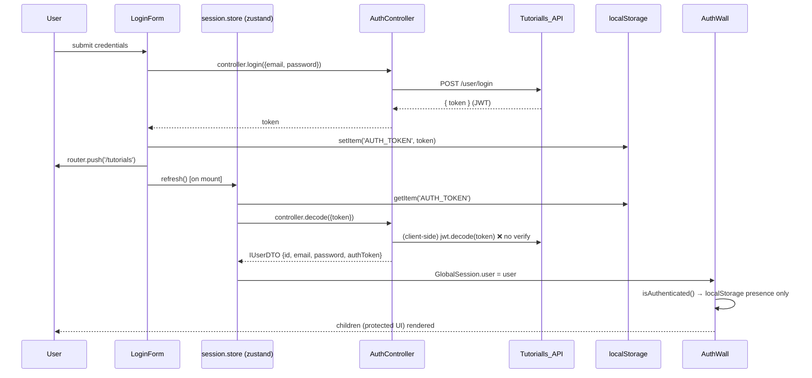

# 01 — Architecture Deep Dive

**Scope:** `tutorialls/src/@module/` (85 files) plus the presentation layer wiring that consumes it.
**Verdict:** A genuine, unusually elaborate **Clean + Hexagonal** architecture running **client-side** inside a Next.js 14 app — structurally authentic, with 3 purity violations and several wiring bugs.

---

## 1. Layer Map

| Layer | Physical path | Contents | Framework imports? |
|---|---|---|---|
| **Domain** | `src/@module/domain/` | Pure TS contracts: `entity/` (classes with `toDTO/fromDTO`), `gateway/` (interfaces), `service/` (interfaces), `use_case/` (interfaces), `DTO/` (interfaces) | ❌ Zero — pure TS ✅ |
| **Application** | `src/@module/application/` | `controller/` (Auth, Tutorial), `service/` (facades), `use_case/` (10 implementations), `gateway/` (Sanity CMS + Axios HTTP adapters), `support/` (abstract classes that property-inject gateways) | ✅ depends on domain interfaces only |
| **Infrastructure** | `src/@module/infra/` | `config/` (env aggregation, granular config values), `engine/` (jwt, http axios/node fetch, cms sanity clients) | ✅ axios, jsonwebtoken, sanity |
| **Presentation** | `src/app/`, `src/component/`, `src/hook/`, `src/store/`, `src/provider/`, `src/global/` | Next.js pages, React components, react-query hooks, zustand stores, TanStack provider, `GlobalSession` | ✅ Next.js / React |

```
Presentation (hooks/components/stores)
        │  calls MODULES.APPLICATION.CONTROLLER.X()
        ▼
Application (controllers → services → use cases → gateways)
        │
        ▼
Infrastructure (engines: axios / fetch / sanity / jwt / config)
        │
        ▼
Domain (interfaces & entities — the contract everything implements)
```

---

## 2. Dependency Injection System

There is **no `inversify.config.ts`** — instead a *module triad* per layer:

| Triad file | Role |
|---|---|
| `{layer}.module.ts` | Creates a `Container`, binds every symbol (`autoBindInjectable: true`, `defaultScope: 'Singleton'`) |
| `{layer}.registry.ts` | Declares the `Symbol.for()` registry tree |
| `{layer}.factory.ts` | Exports typed getter functions that pull singletons out of the container (`MODULES.APPLICATION.CONTROLLER.AUTH()`) |

**Root composition** (`src/@module/`):

- `app.module.ts` — merges `INFRA_MODULE` + `APPLICATION_MODULE` via `Container.merge`
- `app.registry.ts` — the full `MODULE` symbol tree (namespaced `Symbol.for()`)
- `app.facotry.ts` — the `MODULES` factory object *(note the misspelling `facotry`)*

**Symbol convention** — collision-safe global symbols:

```ts
// src/@module/application/use_case/use_case.registry.ts
Symbol.for('MODULE::APP::USE_CASE::TUTORIAL::FILTER::BY::TITLE')
Symbol.for('MODULE::INFRA::ENGINE::GATEWAY::HTTP::AXIOS')
```

**Injection styles:**

- **Lazy property injection** via `inversify-inject-decorators` — used in support/config/gateway classes to break circular dependencies: `@injectEngine(MODULE.INFRA.ENGINE.GATEWAY.HTTP.AXIOS)` / `@injectConfig(...)` / `@injectGateway(...)` (e.g. `config.module.ts:40`, `engine.module.ts:28`, `gateway.module.ts:25`).
- **Constructor injection** — used for controllers/services/use-cases (e.g. `auth.service.ts:14-18`).

**Why the unit tests work:** `test/.../use_case.spec.ts` injects mocks via `(uc as any).gateway = mockGateway` — possible *because* use cases receive their gateways through property injection on abstract `support/` base classes (`support/gateway/http/tutorial/tutorial.support.ts`, `support/gateway/http/user/auth.support.ts`).

### DI wiring bugs (with evidence)

| # | Bug | Evidence |
|---|---|---|
| 1 | `SERVICE` key aliases the **use-case** factory (should be `SERVICE_FACTORY`; `service.factory.ts` exists but is never referenced) | `application.factory.ts:84` |
| 2 | HTTP `NODE` symbol occupies the **parent namespace** `...::ENGINE::GATEWAY::HTTP` while `AXIOS` gets the child `...HTTP::AXIOS` | `infra/engine/engine.registry.ts:8` |
| 3 | TUTORIAL factory getter typed `<AxiosHttpAuthGateway>` (copy-paste; actual class is `AxiosHttpTutorialGateway`) | `application/gateway/gateway.factory.ts:18` |
| 4 | `DecoratedGetters` for SERVICES expose use-case methods — silently wrong API for consumers | `application.factory.ts` |

---

## 3. Data Flow



**Call chain (verified in code):**

1. `hook (react-query)` → `MODULES.APPLICATION.CONTROLLER.TUTORIAL()` factory → `TutorialController`
2. `TutorialController` → `TutorialService` (7 injected use cases) → specific `UseCase`
3. Tutorial use cases extend `TutorialSupport` (abstract, injects `ITutorialGateway`) → `AxiosHttpTutorialGateway`
4. Gateway → `AxiosHttpGateway` (thin axios wrapper, `infra/engine/gateway/http/axios/axios.gateway.ts:8-25`) → `{API_URL}/tutorial...`
5. CMS path: `LazyParagraph/LazyImage` → `useParagraph/useImage` (`useQuery`) → `SanityCMSGateway` → `SANITY_CLIENT` dynamic value (`infra/engine/gateway/cms/sanity/sanity.engine.ts:39-47`)

### REST endpoints consumed

| Method | Endpoint | Gateway method |
|---|---|---|
| `POST` | `{API}/user/signup` | `AxiosHttpAuthGateway` (201 → `true`) |
| `POST` | `{API}/user/login` | `AxiosHttpAuthGateway` (→ `{ token }`) |
| `POST` | `{API}/tutorial` | `create` |
| `PATCH` | `{API}/tutorial/{id}` | `update` |
| `DELETE` | `{API}/tutorial/{id}` | `delete` (200 → `true`) |
| `GET` | `{API}/tutorial?page&limit` | `listAll` |
| `GET` | `{API}/tutorial/title?title&page&limit` | `findByTitle` |
| `GET` | `{API}/tutorial/author?author&page&limit` | `findByAuthor` |
| `GET` | `{API}/tutorial/content?keyword&page&limit` | `findByKeywordInContent` |

> ⚠️ **Query-parameter injection risk:** `title`/`author`/`keyword` are interpolated raw (no `encodeURIComponent`) at `tutorial.gateway.ts:82, 96, 114`.

---

## 4. Auth Flow



### Auth findings (client-side only — real risks)

| # | Finding | Evidence |
|---|---|---|
| A1 | **Token "verification" is base64 decode** — `jwt.decode(token)`, no signature/expiry check; the injected `secret` is dead code | `use_case/user/security/decode.use_case.ts:20, 16-17` |
| A2 | **Stale `Authorization` header** — built once at singleton construction from `GlobalSession.user?.authToken`; default scope is Singleton, so a token set *after* first gateway creation is never picked up → `Bearer undefined` | `gateway/http/axios/tutorial/tutorial.gateway.ts:27-31` |
| A3 | **Password enters client memory** — decode returns `password` into `IUserDTO` → zustand store + `GlobalSession` | `decode.use_case.ts:25-27`; `domain/DTO/user.dto.ts:3` |
| A4 | **No server-side guard** — no `middleware.ts`, no API routes, no HttpOnly cookies; `/tutorials` HTML is served to anyone; `AuthWall` is a client redirect | `component/wall/auth.wall.tsx:11-16` (grep: zero `middleware.ts`) |
| A5 | **Race on first mount** — `refresh()` is fired but not awaited before `isAuthenticated()` is checked → protected UI flashes; async data requests may already fire | `auth.wall.tsx:11-16` |
| A6 | **JWT in `localStorage`** — XSS-exfiltratable; `logout()` exists in the store but **no UI calls it** (no logout button) | `login.form.tsx:31`; `session.store.ts:20,41-44` |

---

## 5. Caching Strategy

| Layer | Mechanism | Reality check |
|---|---|---|
| React Query cache | `['paragraph_' + id]` keys for CMS | ❌ **Collision:** `useImage` also uses `'paragraph_' + id` (`image.hook.ts:12`, `paragraph.hook.ts:12`) — image/paragraph caches overwrite each other |
| Tutorial reads | `useMutation` for **all** list/filter hooks | ❌ No `staleTime`/`gcTime`/`invalidateQueries` anywhere — **README's "search caching" claim is false** |
| Next.js data cache | `HttpNodeEngine` with `next: { tags: [url] }` | 💀 Bound but **never used** — only `CachedListAllTutorial` (unused async server component) would exercise it |
| Sanity CDN | `useCdn: true` via env | ⚠️ Flag bug: `env.config.ts:23` `=== 'true' || true` — always on |
| Provider | `QueryClient` at module scope, no options | ⚠️ Default retry/staleTime; created once in `tanstack.provider.tsx:5`, wrapped in `app/layout.tsx:25` |

---

## 6. Registry / Gateway Inventory

### Engine bindings (`infra/`)

| Symbol key | Binding | Status |
|---|---|---|
| `INFRA.CONFIG.*` | `CONFIG`, `ENV`, `API.URL`, `ENCRYPTION.{KEY,ALGORITHM,BREAKPOINT}`, `JWT.SECRET`, `SANITY.{PROJECT.ID,DATASET,USE.CDN}` | Live |
| `INFRA.ENGINE.AUTH.JWT` | `jsonwebtoken` raw lib as DI value | Live (decode only) |
| `INFRA.ENGINE.GATEWAY.HTTP.AXIOS` | `AxiosHttpGateway` | Live |
| `INFRA.ENGINE.GATEWAY.HTTP.NODE` | `HttpNodeEngine` (fetch + ISR tags) | 💀 **Dead** — never injected by any gateway |
| `INFRA.ENGINE.GATEWAY.CMS.SANITY` | `createClient` from container ENV | Live (no `apiVersion`, see docs/03) |

### Application bindings

| Group | Bindings |
|---|---|
| Gateways | `CMS.SANITY` (SanityCMSGateway), `HTTP.AXIOS.AUTH`, `HTTP.AXIOS.TUTORIAL` |
| Use cases (10) | `USER.{LOGIN, SIGNUP, SECURITY.DECODE}` · `TUTORIAL.{CREATE, UPDATE, DELETE, LIST.ALL, FILTER.BY.{TITLE, CONTENT, AUTHOR}}` |
| Services (2) | `USER.AUTH`, `TUTORIAL` |
| Controllers (2) | `AUTH`, `TUTORIAL` |

**Dead/inert code:** `HttpNodeEngine` · `encrypt`/`decrypt` domain interfaces + DTOs (no implementations) · `CachedListAllTutorial` · `ILoginOutputDTO` · `IOpenModalButtonProps` / `ILazyImageProps` · `updateTutorialFormSchema` · `filter.hook.ts` (never imported) · SWR dependency.

---

## 7. Purity Violations (dependency-inversion breaks)

| # | Violation | Evidence |
|---|---|---|
| P1 | **Application gateway reaches *up* into Presentation state**: `AxiosHttpTutorialGateway` imports and reads `GlobalSession.user?.authToken` (a static, client-side, presentation-layer store) to build its Authorization header | `gateway/http/axios/tutorial/tutorial.gateway.ts:15, 27-31` |
| P2 | **Entire Clean/Hexagonal stack runs in the browser**: `'use client'` in `sanity.gateway.ts:1` and `session.store.ts:1`; server components (`app/tutorials/page.tsx`) only wrap client islands. The DI graph is instantiated per browser session | `src/@module/application/gateway/cms/sanity/sanity.gateway.ts:1`; `src/store/session.store.ts:1` |
| P3 | **Dead "engines" that break the mental model**: `encrypt`/`decrypt` use-case interfaces exist with config (`ENCRYPTION.*`) but no implementations; `HttpNodeEngine` bound but unused | `domain/use_case/user/security/{encrypt,decrypt}.use_case.ts`; `engine.module.ts:19` |

---

## 8. Design Strengths

- ✅ **Strict TypeScript** (`strict: true`) with decorators + `reflect-metadata` correctly configured for Inversify.
- ✅ **Interface-driven domain**: gateways/services/use-cases all have domain contracts; entities encapsulate `toDTO/fromDTO`.
- ✅ **Consistent module/registry/factory triad** per layer — navigable, predictable structure.
- ✅ **Property injection** makes use cases unit-testable with mock gateways (proven by `use_case.spec.ts`).
- ✅ **Namespaced `Symbol.for()` registry** — collision-safe global symbol discipline.
- ✅ Good component taxonomy (atoms, feature hooks, lazy CMS primitives).
- ✅ Zero XSS-prone HTML injection (`dangerouslySetInnerHTML`/`eval` grep-verified absent).

## 9. Improvement Recommendations

1. **Fix the auth path first** — server-side JWT verification (or remove client decode), per-request Authorization header (axios interceptor reading a token provider), HttpOnly-cookie sessions via middleware. See findings F-03, F-04, F-05.
2. **Convert reads to `useQuery`** with real query keys + `invalidateQueries` after create/update/delete; drop the `useMutation`-as-read pattern.
3. **Fix registry/factory wiring bugs** — `SERVICE` alias, NODE symbol namespace, TUTORIAL getter typing.
4. **Dead-code sweep** — remove `HttpNodeEngine`, encrypt/decrypt interfaces, `CachedListAllTutorial`, dead hooks/schemas/types (~−15% LOC).
5. **Rename pass** — `facotry`, `uce_case`, `format`→`form`, `componente`, `alredy_exists`, `autor`→`author`.
6. **Add `encodeURIComponent`** on all query params (`tutorial.gateway.ts:82,96,114`) and delete `console.log` (`tutorial.gateway.ts:36`).
7. Consider an **ADR** on whether to keep the DI stack client-side vs server components — the current design duplicates effort for little benefit on a read-heavy UI.